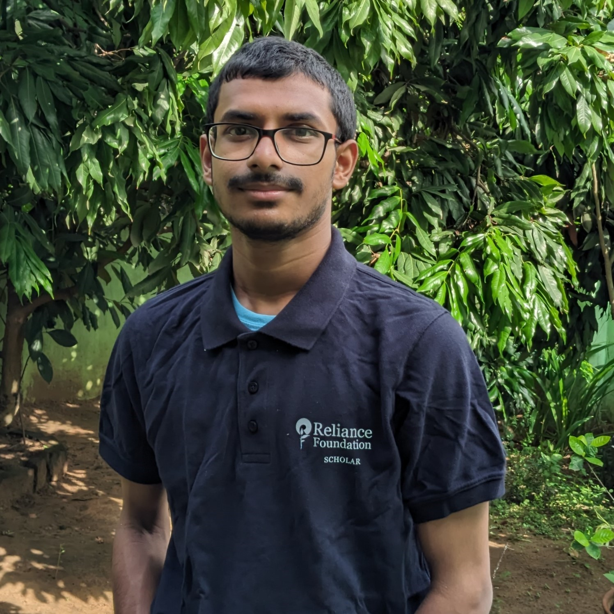

<div align="center">
  
  
  # Hi there, I'm Gourab Gorai 👋

  [](https://www.linkedin.com/in/gourab-gorai-4a51541ba)
  [](https://github.com/GourabGorai)
  [](https://gourabgorai.netlify.app)
</div>

## 🎓 About Me

I'm a Computer Science enthusiast pursuing my Bachelor of Computer Application (BCA) from Dr. B.C. Roy Academy of Professional Courses (2022-2025). As a Reliance Foundation Scholar (2022), I'm passionate about leveraging technology to solve real-world problems.

## 💻 Technical Skills

```python
skills = {
    'Languages': ['Python (Intermediate)', 'Java (Beginner)', 'HTML', 'CSS', 'JavaScript'],
    'Technologies': ['Machine Learning', 'DBMS'],
    'Tools & Frameworks': ['Git', 'Bootstrap']
}
```

## 🚀 Featured Projects

### 1. Image Recognition System
- Implemented using Logistic Regression
- Machine Learning-based approach
- High accuracy in image classification

### 2. Crypto Prediction
- Developed using Linear Regression
- Predictive analysis of cryptocurrency trends
- Data-driven decision making

### 3. Stock Price Prediction
- Implemented using Random Forest
- Advanced machine learning algorithms
- Real-time market analysis

## 🎯 Achievements

- Reliance Foundation Scholar (2022)
- Multiple certifications in Machine Learning and Web Development
- Successfully completed AI internship with TechSaksham (Microsoft & SAP initiative)

## 📚 Education

- BCA | Dr. B.C. Roy Academy (2022-2025)
- Higher Secondary (Commerce) | Bidhan Chandra Institution (2022)
- Secondary Education | Durgapur Ispat Vidyalaya (2020)

## 🏆 Certifications

- Machine Learning using Python (NIIT)
- Front-End Web Development (Reliance Foundation)
- Applied Machine Learning (Reliance Foundation)
- Cyber Security (Reliance Foundation)
- Python Basics (Infosys Springboard)

## 📫 Get in Touch

- Email: gourabg30march@gmail.com
- LinkedIn: [Gourab Gorai](https://www.linkedin.com/in/gourab-gorai-4a51541ba)
- Phone: +91 7908039405

## 📊 GitHub Stats

<div align="center">
  
[](https://github.com/GourabGorai)

[](https://github.com/GourabGorai)

</div>

---
<div align="center">
  <i>⭐️ If you find my work interesting, don't forget to drop a star! ⭐️</i>
</div>
